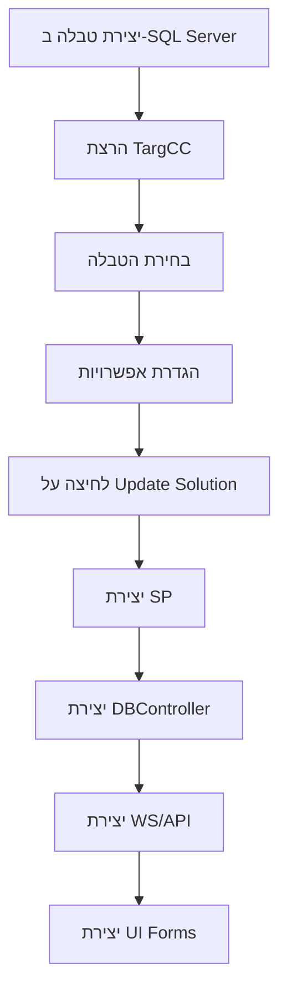
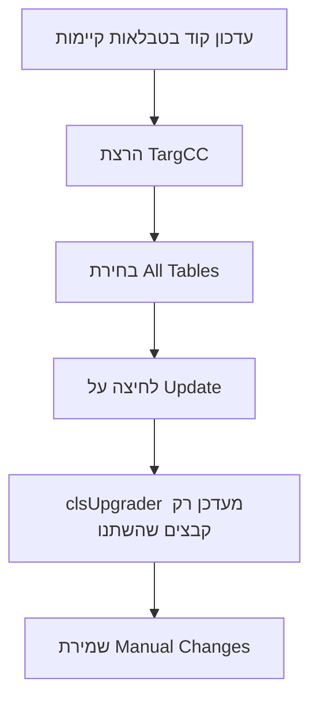

# מסמך אפיון ארכיטקטורה - CodeCreator (Legacy)

## תאריך: דצמבר 2025
## גרסה: 1.0

---

## 1. סקירה כללית

### 1.1 מהו CodeCreator?

CodeCreator הוא **פלטפורמת Code Generation** מקיפה שפותחה על ידי Target Systems. המערכת מייצרת אוטומטית קוד עבור:
- Stored Procedures ל-SQL Server
- Data Access Layer (DBController)
- Web Services / Web API
- Windows Forms UI
- Task Managers
- כלי הצפנה

### 1.2 טכנולוגיות בשימוש

| רכיב | טכנולוגיה | גרסה |
|------|-----------|------|
| **שפת תכנות** | VB.NET | - |
| **Framework** | .NET Framework | 4.8 |
| **UI Framework** | Windows Forms | - |
| **בסיס נתונים** | SQL Server | SqlClient |
| **IDE** | Visual Studio | - |
| **Source Control** | TFS | http://odin:8080/tfs/target |
| **Deployment** | ClickOnce | - |

---

## 2. מבנה הפרויקט

### 2.1 מבנה תיקיות

```
C:\Disk1\CodeCreator\
├── CodeCreator.sln              # Solution File
├── .editorconfig                # Editor Configuration
│
├── _Dependencies/               # תלויות חיצוניות
│   ├── AuditCommon.dll         # ספריית Auditing
│   ├── TargetSMS019.dll        # שליחת SMS/Email
│   ├── TargSolMan.dat          # קובץ נתונים
│   └── NimbusTo260620.pfx      # תעודה לחתימה
│
├── DBAnalyser/                  # ספריית ניתוח DB
├── CodeAnalyser/                # ספריית ניתוח קוד
├── CodeWriter/                  # ספריית יצירת קוד
│
├── TargCC/                      # אפליקציה ראשית
├── SolutionManager/             # ניהול Solutions
├── TargCCDesignerTools/         # כלי עיצוב
├── TargControllerCreator/       # כלי הצפנה
├── ControllerPinger/            # ניטור אפליקציות
│
└── packages/                    # NuGet Packages
```

### 2.2 פרויקטים ב-Solution

| פרויקט | GUID | סוג | תפקיד |
|--------|------|-----|-------|
| **DBAnalyser** | 673E0BCE-BAE8-46E3-9339-82411DBBE1C6 | Library | ניתוח סכמת DB |
| **CodeAnalyser** | 21678355-2099-416D-9952-4B74B9E05084 | Library | ניתוח קוד קיים |
| **CodeWriter** | E7FFD6D8-F462-4C71-98DB-3D95BF6C4699 | Library | יצירת קוד |
| **TargCC** | D012719D-5B1A-4986-93F3-91BB082F7B95 | WinExe | GUI ראשי |
| **SolutionManager** | D8E76A66-F9C8-4865-BBAF-9FF0BE8CD218 | WinExe | ניהול Projects |
| **TargCCDesignerTools** | 1D7161AB-0A7C-40F6-8ACF-DFF8FBBBCA0C | WinExe | כלי Designer |
| **TargControllerCreator** | 92239EE9-D4A2-46EB-9BB0-97F47DE80548 | WinExe | הצפנה |
| **ControllerPinger** | 3174C1B6-895F-453B-9D67-B8C7D18393C0 | WinExe | Health Monitor |
| **_Dependencies** | 26FDE381-4ABD-4808-8A28-7406A45174FD | Library | DLLs חיצוניים |

---

## 3. ארכיטקטורה - שכבות

```
┌─────────────────────────────────────────────────────────────────┐
│                    שכבת ממשק משתמש (UI Layer)                   │
│  ┌─────────────┐ ┌─────────────┐ ┌─────────────┐ ┌────────────┐ │
│  │   TargCC    │ │ SolManager  │ │ Designer    │ │  Pinger    │ │
│  │  (Main GUI) │ │ (Solutions) │ │  Tools      │ │ (Monitor)  │ │
│  └─────────────┘ └─────────────┘ └─────────────┘ └────────────┘ │
└─────────────────────────────────────────────────────────────────┘
                              ↓
┌─────────────────────────────────────────────────────────────────┐
│                 שכבת לוגיקה עסקית (Business Logic)               │
│  ┌──────────────────────────────────────────────────────────┐   │
│  │                   clsCoordinator                         │   │
│  │        (תיאום בין Analysis, Generation ו-Writing)        │   │
│  └──────────────────────────────────────────────────────────┘   │
│  ┌──────────────┐ ┌───────────────┐ ┌───────────────────────┐   │
│  │ CodeAnalyser │ │  CodeWriter   │ │      DBAnalyser       │   │
│  │  (Analysis)  │ │ (Generation)  │ │   (Schema Reading)    │   │
│  └──────────────┘ └───────────────┘ └───────────────────────┘   │
└─────────────────────────────────────────────────────────────────┘
                              ↓
┌─────────────────────────────────────────────────────────────────┐
│                    שכבת נתונים (Data Layer)                     │
│  ┌──────────────────┐  ┌────────────────────────────────────┐   │
│  │   SQL Server     │  │       File System Templates        │   │
│  │   (SqlClient)    │  │         (Resources/*.txt)          │   │
│  └──────────────────┘  └────────────────────────────────────┘   │
└─────────────────────────────────────────────────────────────────┘
```

---

## 4. מודול DBAnalyser - ניתוח בסיס נתונים

### 4.1 מחלקות עיקריות

#### clsDatabase
הייצוג הראשי של בסיס הנתונים.

```vb
Public Class clsDatabase
  ' Properties
  Private _Name As String
  Private _IsAlwaysEncrypted As Boolean
  Private _Relationships As clsRelationshipCol
  Private _Tables As clsTableCol
  Private _ComboListQueries As List(Of String)

  ' Methods
  Public Function Fill(vDBConn, vDBName, vSystemTablesOnly, vVerifyValidity)
  Public Function GetSystemData() As String
  Public Function GetVersions() As String
  Public Function WriteVersion(vVersion, vAuthToWS, vUserIdModel)
End Class
```

#### clsTable
ייצוג טבלה בודדת.

```vb
Public Class clsTable
  Private _SQLTableName As String
  Private _Columns As clsColumnCol
  Private _Indexes As clsIndexCol
  Private _isUsedForIdentity As Boolean
  Private _TakesPartInIdentityDecisions As Boolean
End Class
```

#### clsColumn
ייצוג עמודה בטבלה.

```vb
Public Class clsColumn
  Private _SQLFieldName As String
  Private _SQLDataType As String
  Private _NETDataType As String
  Private _isIdentity As Boolean
  Private _isPrimaryKey As Boolean
  Private _isForeignKey As Boolean
  Private _AlwaysEncryption As enmAlwaysEncryptedType
End Class
```

#### clsRelationship
ייצוג קשר בין טבלאות.

```vb
Public Class clsRelationship
  Private _Name As String
  Private _PrimaryKeyTable As clsTable
  Private _ForeignKeyTable As clsTable
  Private _RelationshipType As enmRelationshipType ' OneToOne, OneToMany
End Class
```

### 4.2 תהליך קריאת Schema

```
1. התחברות לשרת SQL עם Connection String
2. קריאת רשימת הטבלאות מ-sys.tables
3. עבור כל טבלה:
   - קריאת עמודות מ-sys.columns
   - קריאת אינדקסים מ-sys.indexes
   - זיהוי Primary Keys ו-Foreign Keys
4. קריאת Relationships מ-sys.foreign_keys
5. בניית גרף הקשרים בין הטבלאות
6. זיהוי טבלאות מערכת (עם prefix c_)
```

---

## 5. מודול CodeAnalyser - ניתוח קוד קיים

### 5.1 מחלקות עיקריות

| מחלקה | תפקיד |
|-------|-------|
| **clsConfig** | הגדרות Configuration של הפרויקט |
| **clsController** | ניתוח Controller classes |
| **clsStoredProcedures** | ניתוח SQL Stored Procedures |
| **clsWebService** | ניתוח Web Services |
| **clsWebAPI** | ניתוח Web API endpoints |
| **clsWinF** | ניתוח Windows Forms |

### 5.2 clsConfig - הגדרות קונפיגורציה

```vb
Public Class clsConfig
  ' מודלי אימות
  Public Enum enmAuthenticatonModel
    UD
    SpecificUserCredentials   ' UserName + Password
    ActiveUserCredentials     ' Network/Domain Name
    ApplicationCredentials    ' Application Name + Password
    None
  End Enum

  ' מודלי זיהוי משתמש
  Public Enum enmUserIdentificationModel
    UD
    ByApplicationUser
    ByDomainUser
    ByDomainGroup
  End Enum

  ' הגדרות Grid
  Public Enum enmGridUpdateMethod
    UD
    ByRow
    ByGrid
  End Enum

  ' מודלי טפסים
  Public Enum enmFormsModel
    UD
    MenuTree
    MenuRibbon
  End Enum

  ' Properties
  Private _Server As String
  Private _AnalysisDatabase As String
  Private _DoSprocs As Boolean
  Private _DoDBController As Boolean
  Private _DoWS As Boolean
  Private _DoWSController As Boolean
  Private _DoWinF As Boolean
  Private _CustomWinFormProjectsToDo As List(Of String)
  Private _DecipherKey As String
  Private _ColourFormBackground As String
  ' ... עוד הגדרות
End Class
```

### 5.3 פורמטים נתמכים לניתוח

- **C# Classes** - Controllers, Services
- **VB.NET Classes** - Windows Forms, Business Logic
- **SQL Stored Procedures** - CRUD Operations
- **Web.config / App.config** - הגדרות אפליקציה
- **ASMX Web Services** - Legacy Web Services
- **Web API Controllers** - RESTful endpoints

---

## 6. מודול CodeWriter - יצירת קוד

### 6.1 מחלקות עיקריות

#### clsCoordinator
המחלקה המרכזית שמתאמת את כל תהליך יצירת הקוד.

```vb
Public Class clsCoordinator
  Public Enum enmPhase
    StoredProcedure
    DBController
    WS
    WebAPI
    WSController
    WinF
    Intitialize
    TaskManager
  End Enum

  ' Event לעדכון סטטוס
  Public Event evtStatusNMessage(ByVal ePhase As enmPhase, ByVal eMessage As String)

  ' Methods
  Public Sub New(vConfig, vVerifyValidity, vCheckingForUpdate)
  Public Function GetVersionsFromDatabase() As String
  Public Function WriteVersionToDatabase(vVersion) As String
  Public Function PrepareDatabase() As String
End Class
```

#### clsWriter
אחראי על כתיבת הקבצים הפיזית לדיסק.

#### clsUpgrader
אחראי על שדרוג קוד קיים ללא מחיקה.

### 6.2 Templates

קבצי ה-Templates נמצאים בתיקיית Resources ומכילים:

| קטגוריה | תבניות |
|---------|---------|
| **C# Code** | fileCs*.txt |
| **Task Manager** | file*Task*.txt |
| **Windows Forms** | file*WinF*.txt |
| **Encryption** | file*Enc*.txt |
| **Documentation** | fileTutorial*.txt |

### 6.3 תהליך יצירת קוד

```
1. קריאת הגדרות מקובץ _TargCC.def
2. התחברות ל-DB וקריאת Schema
3. עבור כל טבלה שנבחרה:
   a. יצירת Stored Procedures
   b. יצירת DB Controller class
   c. יצירת Web Service/API endpoint
   d. יצירת WS Controller
   e. יצירת Windows Form (Entity + Collection)
4. עדכון גרסה ב-DB
5. שמירת הקבצים לתיקיות המתאימות
```

---

## 7. אפליקציות UI

### 7.1 TargCC - האפליקציה הראשית

**קובץ ראשי:** `frmMain.vb`

**פונקציות עיקריות:**
- התחברות לבסיס נתונים
- בחירת טבלאות לעיבוד
- הגדרת פרמטרי יצירת קוד
- הפעלת תהליך ה-Code Generation
- הצגת תוצאות ולוגים

**תהליך טעינה:**
```vb
Private Sub frmMain_Load()
  1. קריאת Readme.txt
  2. טעינת צבעים לקומבו בוקסים
  3. קריאת Settings מ-My.Settings
  4. חיפוש קובץ _TargCC.def בתיקיית DBController
  5. טעינת הגדרות מהקובץ
  6. אימות התחברות ל-DB
End Sub
```

### 7.2 SolutionManager

**קובץ ראשי:** `frmMain.vb`

**פונקציות עיקריות:**
- ניהול Companies (חברות)
- ניהול Projects
- הגדרות Certificate לחתימה
- יצירת ClickOnce deployments
- Obfuscation עם ConfuserEx

### 7.3 TargControllerCreator

**כלי הצפנה הכולל:**
- AES Encryption
- Triple DES Encryption
- שמירת מפתחות ב-Settings

### 7.4 ControllerPinger

**Health Monitor הכולל:**
- ניטור זמינות אפליקציות
- שליחת Email alerts
- קריאת credentials מוצפנים מ-config

---

## 8. טבלאות מערכת (System Tables)

המערכת עובדת עם טבלאות מערכת בעלות prefix `c_`:

| טבלה | תפקיד |
|------|-------|
| **c_User** | משתמשים |
| **c_Role** | תפקידים |
| **c_UserRole** | שיוך משתמש לתפקיד |
| **c_Table** | מטא-דאטה על טבלאות |
| **c_Enumeration** | ערכי Enum |
| **c_AlertMessage** | הודעות שגיאה |
| **c_SystemDefault** | הגדרות מערכת |
| **c_Language** | שפות נתמכות |
| **c_Lookup** | טבלאות lookup |
| **c_LoggedLogin** | לוג התחברויות |
| **c_LoggedAlert** | לוג שגיאות |
| **c_Job** | עבודות מתוזמנות |
| **c_MFA** | אימות דו-שלבי |
| **c_ObjectToTranslate** | תרגומים |
| **c_ObjectTranslation** | טקסטים מתורגמים |

---

## 9. תהליכי עבודה עיקריים

### 9.1 הוספת טבלה חדשה



### 9.2 שדרוג גרסה



---

## 10. קבצי קונפיגורציה

### 10.1 _TargCC.def

קובץ ההגדרות הראשי לפרויקט, נמצא בתיקיית DBController:

```
Server=ServerName\Instance
AnalysisDatabase=DatabaseName
AnalysisDatabaseIntegratedSecurity=True
DoSprocs=True
DoDBController=True
DoWS=True
DoWSController=True
DoWinF=True
ApplicationAuthenticationToWS=ApplicationCredentials
UserIdentificationModel=ByApplicationUser
DecipherKey=***encrypted***
ColourFormBackground=SeaShell
...
```

### 10.2 App.config Settings

**TargCC:**
- DeploymentServer
- SolutionLocation
- Language

**SolutionManager:**
- Company (Target/Vargus)
- SourceCodeRootFolder
- PublishRootFolder
- ExemptCompanies (encrypted)

---

## 11. אבטחה

### 11.1 שיטות הצפנה

- **DES** - Legacy encryption
- **Triple DES** - Legacy encryption
- **AES** - Modern encryption
- **SHA256** - Password hashing

### 11.2 אחסון רגישים

- סיסמאות מוצפנות ב-config
- מפתחות הצפנה ב-Settings
- תעודות חתימה בקובץ PFX

---

## 12. חולשות ידועות (לשדרוג)

| בעיה | חומרה | המלצה |
|------|-------|--------|
| VB.NET בלבד | בינונית | מעבר ל-C# |
| .NET Framework 4.8 | גבוהה | מעבר ל-.NET 6+ |
| Windows Forms | בינונית | מעבר ל-React/WPF |
| TFS | נמוכה | מעבר ל-Git |
| Hardcoded credentials | גבוהה | שימוש ב-Key Vault |
| ללא Unit Tests | גבוהה | הוספת בדיקות |
| SQL Injection פוטנציאלי | גבוהה | שימוש ב-Parameters |

---

## 13. תלויות חיצוניות

### 13.1 NuGet Packages

- Microsoft.VisualStudio.Setup.Configuration.Interop (1.11.1173)
- System.Data.SqlClient
- System.Web

### 13.2 DLLs מותאמים

- AuditCommon.dll - Triggers לביקורת
- TargetSMS019.dll - שליחת SMS/Email
- NETEncryption - ספריית הצפנה פנימית

---

## סיכום

CodeCreator הוא מערכת Code Generation מורכבת ומקיפה שפותחה לאורך שנים.
הארכיטקטורה מודולרית ומאפשרת הרחבה, אך הטכנולוגיות ישנות ודורשות שדרוג.

המסמך הבא יפרט את הפונקציונליות המלאה של כל מודול.
