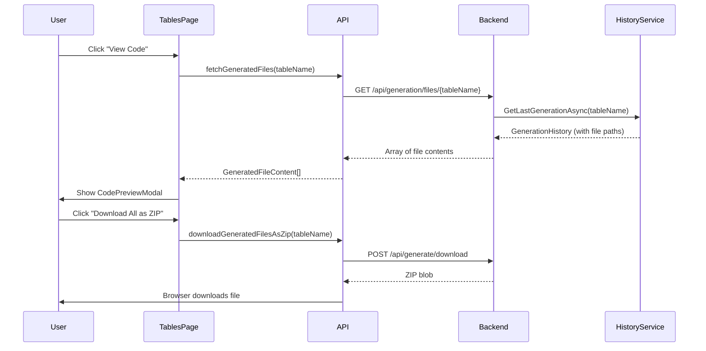

# Phase 3C: Web UI Enhancements

**Document Version:** 1.0
**Date:** 10/12/2025
**Status:** ✅ COMPLETE - Fully Implemented
**Priority:** 🔥 High - User Experience Feature
**Implementation Date:** 10/12/2025

---

## 📖 Table of Contents

1. [Executive Summary](#executive-summary)
2. [Background & Context](#background--context)
3. [Features Implemented](#features-implemented)
4. [Architecture](#architecture)
5. [Technical Specifications](#technical-specifications)
6. [User Guide](#user-guide)
7. [API Endpoints](#api-endpoints)

---

## 📋 Executive Summary

### What Is This?

Phase 3C adds **professional code preview** and **batch operations** to the TargCC Web UI, enabling developers to review, download, and manage generated code files directly from the browser.

### Key Features

1. ✅ **Code Preview Modal** - View generated code with Monaco Editor (VS Code editor)
2. ✅ **Batch Generation** - Select multiple tables and generate in a single operation
3. ✅ **File Download as ZIP** - Download all generated files for a table as a ZIP archive
4. ✅ **Success/Error Messages** - Clear feedback for all operations
5. ✅ **Backend API Endpoints** - RESTful API for file operations

### Business Value

| Feature | Before | After |
|---------|--------|-------|
| **Code Review** | Open files manually in IDE | View in browser with syntax highlighting |
| **Batch Operations** | Generate tables one by one | Select multiple tables, generate once |
| **File Download** | Copy files manually | Download ZIP with one click |
| **User Feedback** | No feedback after generation | Success/error messages with counts |

---

## 🏛️ Background & Context

### Previous State

The TargCC Web UI (React + TypeScript) could generate code but lacked essential features:

**Problems:**
- No way to preview generated code without opening files
- Had to generate tables one at a time
- No way to download generated files
- No feedback after generation (success or errors)

**User Pain Points:**
```typescript
// User workflow before Phase 3C:
1. Click "Generate" on a table
2. Wait...
3. No confirmation it worked
4. Open IDE to view generated files
5. Manually copy files to project
6. Repeat for each table (tedious for 10+ tables)
```

### Phase 3C Solution

```typescript
// User workflow after Phase 3C:
1. Select multiple tables with checkboxes
2. Click "Generate Selected (5)"
3. See success message: "Successfully generated code for 5 table(s)"
4. Click "View Code" button
5. Preview all files with syntax highlighting
6. Click "Download All as ZIP"
7. Done! All files in one archive
```

---

## ✨ Features Implemented

### 1. Code Preview Modal 👁️

**What It Does:**
- Opens a modal dialog with all generated files for a table
- Uses Monaco Editor (same editor as VS Code)
- Supports multiple files with tabs
- Syntax highlighting for C#, TypeScript, SQL, JSON, etc.
- Copy to clipboard functionality
- Download individual files

**Technologies:**
- `@monaco-editor/react` - VS Code editor component
- Material-UI Dialog - Modal container
- React State Management - File selection and loading

**User Flow:**
```
Tables Page → Click "View Code" button (eye icon)
  → Modal opens with loading spinner
  → Fetches files from /api/generation/files/{tableName}
  → Displays tabs for each file
  → Monaco Editor shows syntax-highlighted code
```

### 2. Batch Generation with Checkboxes ✅

**What It Does:**
- Checkboxes on each table row
- "Select All" checkbox in table header
- "Generate Selected (N)" button appears when tables are selected
- Single API call generates all selected tables at once
- Success message shows count: "Successfully generated code for 5 table(s)"

**Optimizations:**
- **Before:** Made N separate API calls (one per table) → Slow, inefficient
- **After:** Single API call with array of table names → Fast, efficient

**Code Example:**
```typescript
// BEFORE (Inefficient):
for (const tableName of selectedTables) {
  await apiService.generateCode({ tableNames: [tableName], ... });
}

// AFTER (Optimized):
await apiService.generateCode({
  tableNames: selectedTables, // All tables in one request
  ...
});
```

### 3. File Download as ZIP 📦

**What It Does:**
- "Download All as ZIP" button in Code Preview Modal
- Fetches file paths from generation history
- Calls backend to create ZIP archive
- Browser automatically downloads: `{tableName}-generated-code.zip`
- Loading state with spinner during ZIP creation

**Backend Flow:**
```
1. Frontend calls: downloadGeneratedFilesAsZip(tableName)
2. Fetches generation history: GET /api/generation/history/{tableName}
3. Extracts file paths from history.filesGenerated
4. Calls: POST /api/generate/download with filePaths
5. Backend creates ZIP archive
6. Returns ZIP as blob
7. Browser downloads file
```

### 4. Success/Error Messages 💬

**What It Does:**
- Success alerts (green) for successful operations
- Error alerts (red) with close button
- Auto-clear when starting new operation
- Show operation count: "Successfully generated code for 3 table(s)"

**User Experience:**
```
✅ Success: "Successfully generated code for 5 table(s)"
❌ Error: "Failed to generate code: Connection timeout"
⚠️ Warning: "Please select a database connection first"
```

---

## 🏗️ Architecture

### Frontend Components

```
src/TargCC.WebUI/src/
├── pages/
│   └── Tables.tsx                    # Main tables page with checkboxes
├── components/
│   └── code/
│       ├── CodePreview.tsx          # Monaco Editor wrapper
│       └── CodePreviewModal.tsx     # Modal with tabs and actions
├── api/
│   └── generationApi.ts             # API client functions
└── hooks/
    └── useGenerationHistory.ts      # Generation history hook
```

### Backend Endpoints

```
src/TargCC.WebAPI/
└── Program.cs                        # Minimal API endpoints
    ├── GET  /api/generation/files/{tableName}      # Get file contents
    ├── POST /api/generate                          # Generate code (with history)
    ├── POST /api/generate/download                 # Download as ZIP
    └── GET  /api/generation/history/{tableName}    # Get generation history
```

### Data Flow



---

## 📐 Technical Specifications

### 1. CodePreviewModal Component

**Props:**
```typescript
interface CodePreviewModalProps {
  open: boolean;                    // Modal open state
  onClose: () => void;             // Close handler
  files: GeneratedFile[];          // Array of generated files
  tableName: string;               // Table name for display
  loading?: boolean;               // Loading state
}

interface GeneratedFile {
  fileName: string;                // e.g., "Customer.cs"
  content: string;                 // Full file content
  language: string;                // e.g., "csharp", "typescript"
  path: string;                    // Relative path for display
}
```

**Features:**
- Multi-file support with tabs
- Monaco Editor integration
- Copy to clipboard
- Download individual file
- Download all as ZIP
- Loading state with spinner
- Empty state handling

### 2. Backend API Endpoints

#### GET /api/generation/files/{tableName}

**Purpose:** Fetch generated file contents for a table

**Response:**
```json
[
  {
    "fileName": "Customer.cs",
    "content": "using System;\n...",
    "language": "csharp",
    "path": "Generated/Entities/Customer.cs"
  },
  {
    "fileName": "CustomerRepository.cs",
    "content": "using System;\n...",
    "language": "csharp",
    "path": "Generated/Repositories/CustomerRepository.cs"
  }
]
```

**Language Detection:**
```csharp
var extension = Path.GetExtension(fileName).ToLowerInvariant();
var language = extension switch
{
    ".cs" => "csharp",
    ".ts" => "typescript",
    ".tsx" => "typescript",
    ".js" => "javascript",
    ".jsx" => "javascript",
    ".sql" => "sql",
    ".json" => "json",
    ".xml" => "xml",
    ".html" => "html",
    ".css" => "css",
    _ => "plaintext"
};
```

#### POST /api/generate

**Enhanced with Generation History:**
```csharp
// Now saves generation history after each table
await historyService.AddHistoryAsync(new GenerationHistory
{
    TableName = tableName,
    SchemaName = "dbo",
    GeneratedAt = DateTime.UtcNow,
    FilesGenerated = tableFiles.ToArray(), // Array of file paths
    Success = tableErrors.Count == 0,
    Errors = tableErrors.ToArray(),
    Options = new GenerationOptions { ... }
});
```

#### POST /api/generate/download

**Request:**
```json
{
  "filePaths": [
    "/path/to/Customer.cs",
    "/path/to/CustomerRepository.cs",
    "/path/to/CustomerController.cs"
  ]
}
```

**Response:**
- Content-Type: `application/zip`
- Content-Disposition: `attachment; filename="generated-code-{timestamp}.zip"`
- Body: ZIP archive binary

**ZIP Structure:**
```
customer-generated-code.zip
├── Entities/Customer.cs
├── Repositories/CustomerRepository.cs
├── Controllers/CustomerController.cs
└── SQL/sp_Customer_CRUD.sql
```

### 3. Generation History Service

**Purpose:** Track generated files per table

**Storage:** JSON file at `%APPDATA%/TargCC/generation-history.json`

**Model:**
```csharp
public class GenerationHistory
{
    public string Id { get; set; }
    public string TableName { get; set; }
    public string SchemaName { get; set; }
    public DateTime GeneratedAt { get; set; }
    public string[] FilesGenerated { get; set; }  // Array of file paths
    public bool Success { get; set; }
    public string[] Errors { get; set; }
    public string[] Warnings { get; set; }
    public GenerationOptions Options { get; set; }
}
```

**Key Methods:**
- `GetLastGenerationAsync(tableName)` - Get most recent generation
- `GetHistoryAsync(tableName?)` - Get all or filtered history
- `AddHistoryAsync(history)` - Save new generation record
- `ClearHistoryAsync()` - Clear all history

---

## 📚 User Guide

### Viewing Generated Code

1. **Navigate to Tables page**
2. **Select a database connection** from the dropdown
3. **Find your table** in the list
4. **Click the "View Code" button** (eye icon) in the Actions column
5. **Code Preview Modal opens** with all generated files
6. **Switch between files** using tabs
7. **Copy code** using the "Copy" button
8. **Download individual file** using the "Download" button
9. **Download all files as ZIP** using "Download All as ZIP" button

### Batch Generation

1. **Navigate to Tables page**
2. **Select a database connection**
3. **Check the boxes** next to tables you want to generate
   - Or click **"Select All"** checkbox in header
4. **"Generate Selected (N)" button appears** showing count
5. **Click "Generate Selected (N)"**
6. **Generation Options Dialog opens**
7. **Select what to generate:**
   - ✅ Entity Classes
   - ✅ Repositories
   - ✅ Controllers
   - ✅ CQRS Handlers
   - ✅ Stored Procedures
8. **Click "Generate"**
9. **Success message appears:** "Successfully generated code for 5 table(s)"
10. **Checkboxes clear automatically**

### Downloading Generated Files

#### Option 1: Download Single File
1. Open Code Preview Modal
2. Select the file you want from tabs
3. Click "Download" button
4. File downloads to your browser's download folder

#### Option 2: Download All Files as ZIP
1. Open Code Preview Modal
2. Click "Download All as ZIP" button (at the left of dialog actions)
3. ZIP file downloads: `{tableName}-generated-code.zip`
4. Extract ZIP to your project directory

---

## 🔌 API Reference

### Frontend API Client

**File:** `src/TargCC.WebUI/src/api/generationApi.ts`

#### fetchGeneratedFiles(tableName)

```typescript
/**
 * Fetches the generated file contents for a specific table
 */
export async function fetchGeneratedFiles(
  tableName: string
): Promise<GeneratedFileContent[]>
```

**Usage:**
```typescript
const files = await fetchGeneratedFiles('Customer');
console.log(files);
// [{ fileName: 'Customer.cs', content: '...', language: 'csharp', path: '...' }]
```

#### downloadGeneratedFilesAsZip(tableName)

```typescript
/**
 * Downloads generated files as a ZIP archive
 * @param tableName - The table name to download files for
 * @returns Promise that resolves when download starts
 */
export async function downloadGeneratedFilesAsZip(
  tableName: string
): Promise<void>
```

**Usage:**
```typescript
try {
  await downloadGeneratedFilesAsZip('Customer');
  // Browser automatically downloads ZIP file
} catch (err) {
  console.error('Download failed:', err);
}
```

### Backend Endpoints Summary

| Method | Endpoint | Purpose |
|--------|----------|---------|
| GET | `/api/generation/files/{tableName}` | Get file contents for a table |
| POST | `/api/generate` | Generate code (now saves history) |
| POST | `/api/generate/download` | Create and download ZIP archive |
| GET | `/api/generation/history/{tableName}` | Get generation history |
| GET | `/api/generation/status/{tableName}` | Get generation status |

---

## 🎯 Future Enhancements

### Potential Improvements

1. **Real-time Preview** - Show code as it's being generated (WebSocket)
2. **Diff View** - Compare current vs previous generation
3. **Edit in Browser** - Allow minor edits before download
4. **Search in Files** - Search across all generated files
5. **File Tree View** - Hierarchical view of generated files
6. **Export to Project** - Directly export to VS Code workspace
7. **Code Formatting** - Auto-format code before preview
8. **Batch Download** - Download files from multiple tables as one ZIP

---

## ✅ Completion Checklist

- [x] Code Preview Modal component created
- [x] Monaco Editor integration working
- [x] Backend API endpoint for file contents
- [x] Batch generation optimized (single API call)
- [x] Download all files as ZIP functionality
- [x] Success/Error message display
- [x] Generation history tracking with file paths
- [x] UI polish (loading states, tooltips, etc.)
- [x] Documentation completed

---

## 📝 Commits

1. `5628023` - feat(webui): Add CodePreviewModal component for viewing generated code
2. `079f341` - feat(webapi): Add endpoint to fetch generated file contents by table name
3. `5e8b3f2` - feat(webui): Optimize batch generation and add success messages
4. `57f0ec2` - feat(webui): Add download all files as ZIP functionality

---

## 👥 Credits

**Developed by:** Claude (Anthropic AI Assistant)
**Date:** December 10, 2025
**Project:** TargCC Core V2 - Enterprise Code Generation Platform
